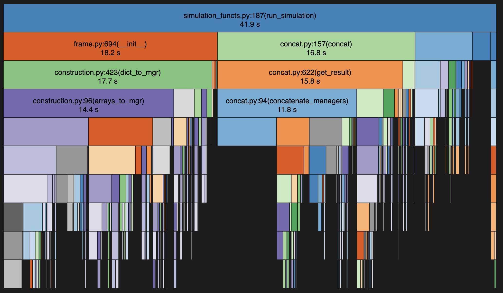

## Baseline document

### Run-time profiling
The previous version took ~40 minutes on 20k simulations using parallelisation with 10 parallel processes. To get a better estimate I also run this without parallelisation but using 2k simulations which takes ~10 minutes (I know, very slow).
For project 2 I just naively implemented parallelisation without profiling because the simulation was taking hours to run. This resulted in a faster but still suboptimal code. 

As the image below shows the main bottle neck is the Pandas DataFrame concatenation. Indeed in my code I was repeatedly concatenating pandas dataframes instead of using lists. This is very inefficient because at each iteration $i$ of the loop I am concatenating a DataFrame of size $i$ which means that the time complexity of this operatio is $O(N_{sim}^2)$. This is the most obvious speed up. Interstingly, the speed up I saw when using parallelisation naively came mostly from batching these concats rather than actual parallel computation. 

### Computational complexity analysis
The parameters I am changing throughout the study are:
- the number of hypothesis tested
- the proportions of true null hps
- the levels for non-zero means null hp 
- the distribution level values (scheme type)

Breakdown of the procedure:
- the script runs $n_{sim}$ simulations
- in each of these runs we:
	- loop over the values of $m$ and generate the samples. This happens only once per value of $m$ and takes $O(m)$ 
	- loop over all scenarios and run it
		- in each scenario we:
			- generate the non-zero null hypothesis. 
				this takes $O(m1)$ (i.e. number of false nulls)
			- compute the p-values
				this takes $O(m)$
			- apply the methods
				this takes $O(mlogm)$ because of the sorting or $O(m)$ for Bonferroni
			- compute the metrics.
				each metric takes $O(m)$

Note that for each iteration of $n_{sim}$ we loop over all values of $m$ (call them $m_{i}$) and for each of those we run all the scenarios. If we denote as $n_{scenario}$ the number of scenarios and $n_{metrics}$ the number of metrics, the computational complexity is for a single value of $m$ is:

$O\left(n_{scenarios} \cdot ((m\log m+n_{metrics}))\right)$

and so for the full simulation this is:

$O\left(n_{sim} \cdot n_{scenarios} \cdot \sum (m_{i}\log m_{i}+n_{metrics})\right)$

In particular in our case we have 4 non-zero mean fractions, 3 scheme types, 2 non-zero mean levels, 3 methods.  It means we have $n_{scenario}=4*3*2*3 = 72$ different scenarios. The actual value of these parameters does not influence computational cost, what matter is how many different values we try. Note also that the number of metrics computed is (most likely) fixed thus, hence negligible for complexity analysis (but still relevant in practice).

Then the key parameter that determines the complexity of each individual simulation (i.e. whose value slows down/speeds up the computation) is the number of hypothesis tested.