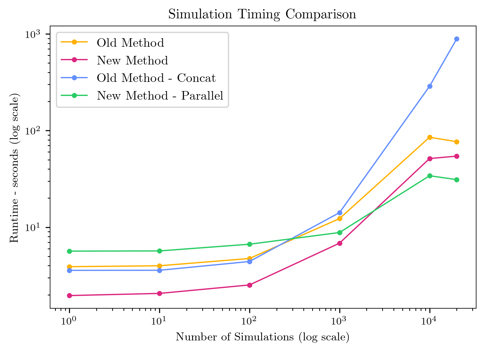
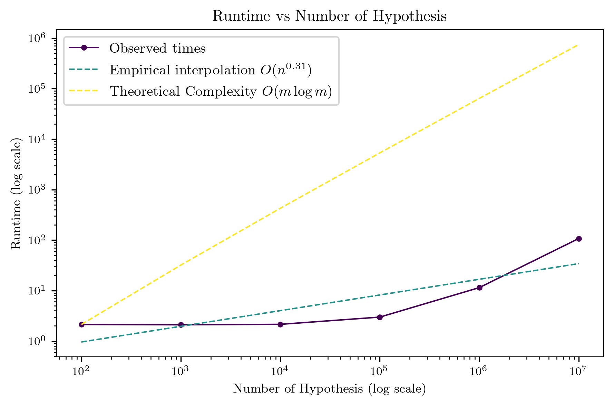
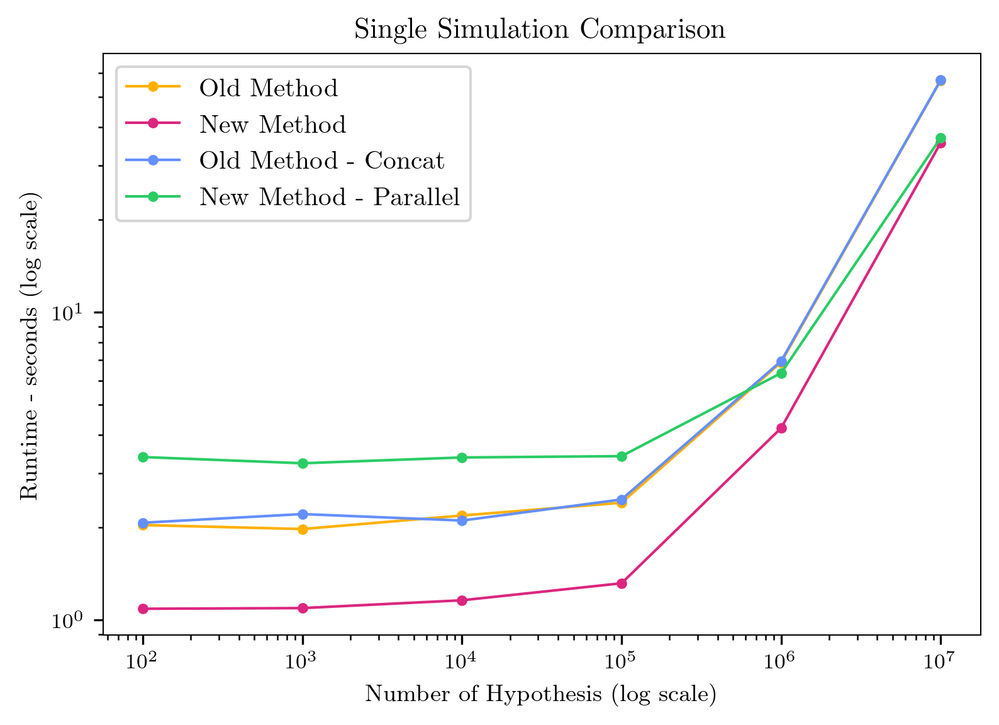
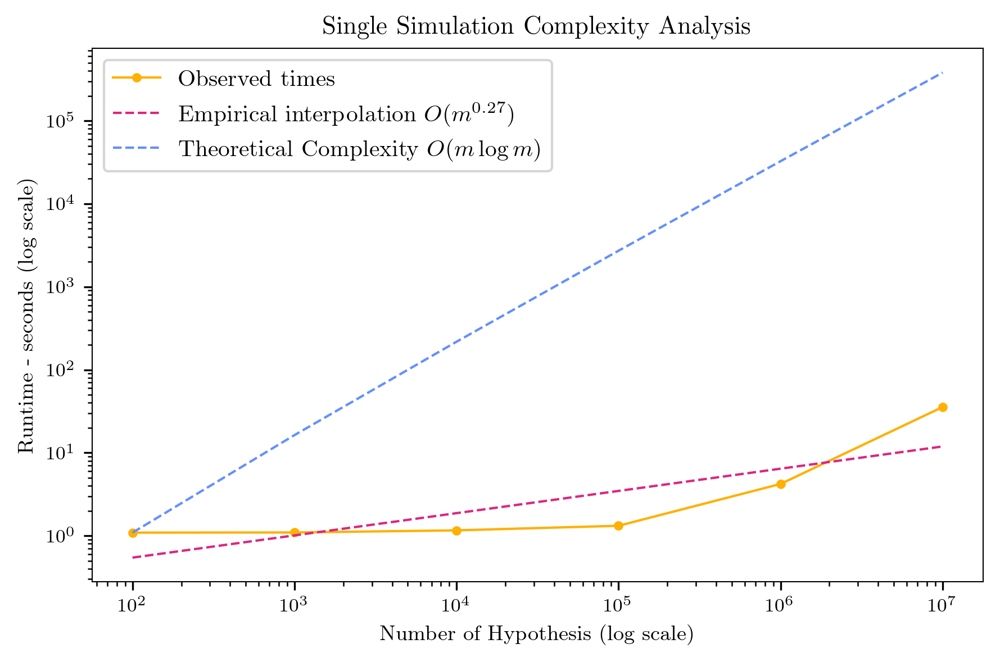

## Optimization summary

This is a brief outline of the improvement I made to speed up the code:
1) As mentioned in `baseline.md` The profiler showed that the main bottleneck is the repeated concatenation of pandas DataFrames. This can be very easily sped up by appending elements to a list and then creating the Pandas DataFrame only when returning the results.
2) According to profiler results, the second big bottleneck is the function `cdf` in `2*(1-cdf(scores))` called during p-value computation. This can be replaced with the more efficient `1-special.erfc(np.abs(z_scores) / np.sqrt(2))`. Time complexity should be the same but `special.erf` is 10x faster in practice ($\approx 1e^{-3}$ vs $\approx 1e^{-4}$ on $n=100$)
3) Profiler shows that the next bottleneck are the functions computing the metrics (e.g. FDR). This was already vectorised in my original code. The next improvement I can implement is to use `numba` to compile the code in C. This adds a bit of overhead at the beginning (because of compilation) but runs faster. The gains are especially relevant as `nsim` grows since the compilation costs gets amortised over a larger number of iterations.
4) Profiler shows next bottleneck is the function `generate_mean` to generate the non-zero null hypothesis. As before this is already vectorised and to make it faster I can compile it in C using numba. There are a few very small modifications required to make this run efficiently with numba such as moving the shuffling of the array outside the function and preallocating part of the memory before calling it (note: this is not strictly required, the computation of p-values should not depend on their order but it felt like the right thing to do. It also adds very little computation time). It also seems like adding the signature explicitly with `@njit(float64[:](int64, int64, int64, int64))` speeds up the code a little bit. I suspect it is due to more efficient compilation. Inded adding the signature makes numba compile the function as soon as it is imported instead of waiting for the first input, evaluating the type and then compiling. In the end it should not matter as much since compilation time is just amortised over all runs.

To see the improvement I run different versions of the simulation with sequential improvments. Note that al of these results do not take into account the time to save files. Moreover all simulations return the same results, up to numerical approximation.
On 1k simulation runs:
- Old version with parallelization takes $21.2s \pm 0.28$
- Removing pd concatenation takes $34.7 \pm 0.15$ and $19.5s\pm 0.12$ with parallelization.
- Changing to erf takes $24.7s \pm 0.18$ and $16.9s \pm 0.63$ with parallelization
- Moving to numba for metrics takes $18.6\pm 0.17$ and $16.5\pm 0.44$. 
- Compiling `generate_means` with numba speeds this up to $16.3s \pm 0.23$ and $17.4s\pm 0.28$ with parallelization. As expected the improvement with parallelization slows down as the runtime of each iteration decreases, especially for $n_{sim}$ small. For instance on 2k simulations we have $27.8s$ with parallelization and $34.1s$ without. Increasing the number of iterations also yield additional advantage by amortizing the compilation of numba functions.

Figure 1 shows the improvement across versions for different number of simulations. The figure compares: 
- Old Method - Concat (blue): this is the version submitted for Unit 2. It uses parallelization because it would be too slow to run otherwise.
- Old Method (yellow): this is the version without pandas concatenation. It uses parallelization because it would be too slow to run otherwise.
- New Method (red): this is the version with all the optimizations mentioned above without parallelization
- New Method - Parallel (green): this is the version with optimized code and with parallel exectution on 10 cores. 

We can see that for small values of $n_{sim}$ the overhead of parallelization make the function run much slower than the optimized version (in red). This disadvantage disappear after $\approx 1k$ runs. It is interesting to see that, for $n_{sim}$ large enough, the old inefficient functions are faster than the optimized version. This shows how powerful parallelization is: even very inefficient code can be mad every fast by distributing the computation.

*Figure 1*: Runtime vs Number of simulation runs for different version of the code.

The last value tried is $20k$ which the value used for the simulation for Unit 2. The runtime for the different functions comes out to (in seconds):
- $959$ for Old Method - Concat
- $164$ for Old Method
- $171$ for New Method 
- $133$ for New Method - Parallel

We have then that the optimized and parallel version is 7 times faster than the original function

Figure 2 displays the plot of empirical vs theoretical complexity and the behaviour of the actual timing data. From this it appears that I have not run yet into the cealing of asymptotic behaviour of the function. Indeed the upper bound for complexity is $O(k*n_{sim})$ where $k$ is a constant depending on the number of scenario I'm running (explained more in detail in `BASELINE.md`). From the plot it is clear that the behaviour of the function of $n$ up to $50k$ is closer to $n^{0.6}$ rathen than $n$. 

*Figure 2*: Empirical complexity (red) vs theoretical upper bound (blue) for the full simulation study under the new (sequential) version of the code

Figure 3 and 4 run a similar analysis for a single simulation with increasing number of hypothesis tested. The plots display a scaling similar to that observed for different number of simulations. 

*Figure 3*: Runtime vs Number of hypothesis tested for a single simulation with different versions of the code

*Figure 4*: Empirical complexity (red) vs theoretical upper bound (blue) for the a single simulation under the new (sequential) version of the code

## Regression test
The script `regression.py` runs validation tests to check if the different version produce the same results. The results are results are not exactly the same because the new version handles the seeding differently. The difference is small (in the order oe $1e-3$ difference in average power) and does not change the results of the simulations. 

In particular the reason behind this difference is that in every simulation scenario I was generating a new non-null hypothesis for each method tested. This is both conceptually wrong (I am not testing the method on the same target) and also slows down the code (I was running the function `generate_means` 3 times). Changing it sped up the code (even if marginally). As for correctness this is surely an issue but not a critical one: since I am generating from the same distribution and averaging over many runs the results are still similar. Modyfing the code gives 

The script `regression.py` runs validation tests to check whether different versions of the code produce consistent results. The outputs are not perfectly identical because the new version initializes the random seed differently. However, the discrepancy is very small (on the order of $10e-3$ in average power) and does not affect the conclusions of the simulations.

The main source of this difference is that in each simulation scenario, I was previously generating new non-null hypothesis for every method being tested. This was conceptually incorrect (each method was effectively being tested on a different target) and it also made the code slower by calling `generate_means` three separate times. After modifying the code so that all methods share the same generated hypothesis, the execution became slightly faster.

In terms of correctness, this issue is not critical. Because all hypotheses were drawn from the same distribution and the results were averaged over many runs, the outcomes remained very similar. The code modification simply ensures conceptual consistency and marginally improves performance.

## Reflection
The optimization that gave me the highest return on investment was surely removing the DataFrame concatenation. As the plots show, this change alone reduced the runtime by 7x. I found this somewhat surprising, as it was an obvious inefficiency, and I’m still not sure how I overlooked it earlier.

The remaining optimizations provided only minor improvements and were likely not worth the effort. The code I had for Unit 2 was already largely vectorized and parallelized, so these adjustments produced relatively small gains given the limited number of iterations. If the simulations were run for a much longer duration, these optimizations would compound and give me a more substantial benefit. However, for $n_{sim}= 20k$ (the setting I'm using) they were ultimately unnecessary.
